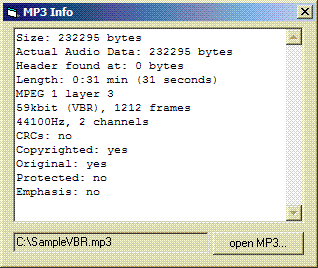



## MP3 info with VBR support

### Description

This class reads information about MP3s.

It supports VBR (both XING and VBRI) and skips ID3v2 and ID3v1 for a pretty accurate calculation of the duration.
 
### More Info
 

             |
---                |---
**Submitted On**   |2007-02-18 17:34:08
**By**             |[Arne Elster](https://github.com/Planet-Source-Code/PSCIndex/blob/master/ByAuthor/arne-elster.md)
**Level**          |Intermediate
**User Rating**    |5.0 (15 globes from 3 users)
**Compatibility**  |VB 6\.0
**Category**       |[Sound/MP3](https://github.com/Planet-Source-Code/PSCIndex/blob/master/ByCategory/sound-mp3__1-45.md)
**World**          |[Visual Basic](https://github.com/Planet-Source-Code/PSCIndex/blob/master/ByWorld/visual-basic.md)
**Archive File**   |[MP3\_info\_w2048912202007\.zip](https://github.com/Planet-Source-Code/arne-elster-mp3-info-with-vbr-support__1-67917/archive/master.zip)

